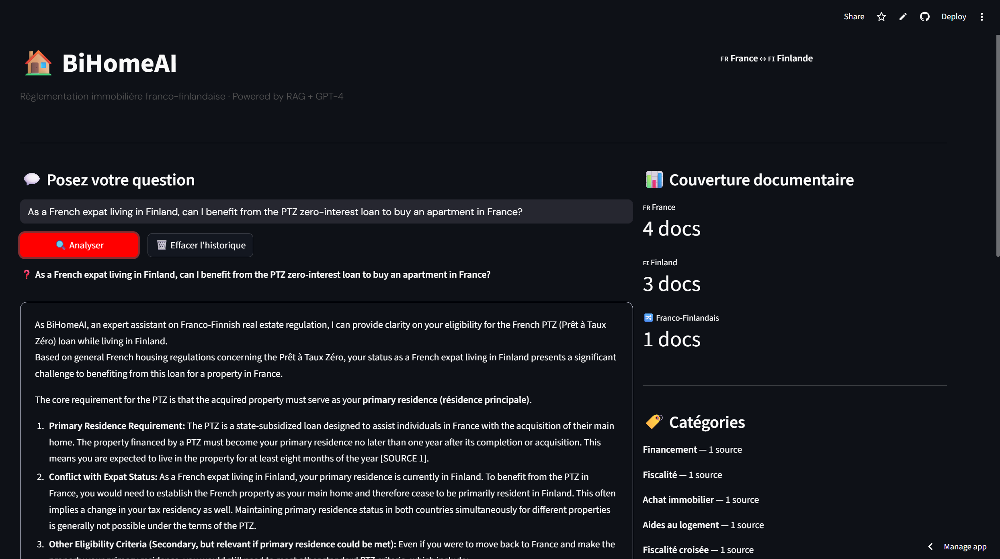

# 🏠 BiHomeAI — Plateforme RAG Franco-Finlandaise

> Système de questions-réponses intelligent sur la réglementation immobilière entre la France et la Finlande, basé sur une architecture RAG (Retrieval Augmented Generation).


---

## 🎯 Problème résolu

Des milliers d'expatriés français en Finlande (et inversement) naviguent seuls des questions complexes : fiscalité croisée, droits des locataires, processus d'achat, aides disponibles. **Aucun outil n'existait** pour comparer et expliquer intelligemment ces deux systèmes en parallèle, avec sources officielles citées.

## 🖥️ Interface



---

## ✨ Fonctionnalités

- **RAG sur textes officiels** : indexation de sources gouvernementales (service-public.fr, vero.fi, kela.fi...)
- **Réponses sourcées** : chaque réponse cite ses sources avec liens vers les textes officiels
- **Couverture cross-border** : convention fiscale France-Finlande, droits des expatriés UE
- **8 documents officiels** indexés dans 6 catégories
- **Historique de conversation** : contexte maintenu sur la session

## 🏗️ Architecture RAG

```
Question utilisateur
        ↓
Gemini Embeddings (models/gemini-embedding-001)
  → Vectorisation de la question
  → Recherche par similarité cosinus dans ChromaDB
  → Top-3 documents pertinents récupérés
        ↓
Gemini 2.5 Flash
  → Contexte = documents récupérés + question
  → Génération de réponse sourcée en français
        ↓
Réponse avec citations + liens officiels
```

## 📚 Base de connaissances

| Catégorie | Pays | Source officielle |
|-----------|------|-------------------|
| PTZ & Financement | 🇫🇷 France | service-public.fr |
| Fiscalité non-résidents | 🇫🇷 France | impots.gouv.fr |
| Achat immobilier | 🇫🇮 Finlande | maanmittauslaitos.fi |
| Aides au logement | 🇫🇮 Finlande | kela.fi |
| Convention fiscale FR-FI | 🇫🇷🇫🇮 Cross-border | vero.fi + impots.gouv.fr |
| DPE & réglementation | 🇫🇷 France | service-public.fr |
| Droits des locataires | 🇫🇮 Finlande | ymparisto.fi |
| Copropriété non-résidents | 🇫🇷 France | service-public.fr |

## 🚀 Installation & Lancement

```bash
# 1. Cloner le repo
git clone https://github.com/NouhailaElbakkioui/BiHomeAI.git
cd BiHomeAI

# 2. Installer les dépendances
pip install -r requirements.txt

# 3. Lancer l'application
streamlit run app.py

# 4. Entrer votre clé Gemini dans la sidebar
# Clé gratuite sur : https://aistudio.google.com
```

## 💡 Exemples de questions

- *"En tant que résident finlandais, puis-je bénéficier du PTZ français ?"*
- *"Comment fonctionne la fiscalité si je loue mon appartement français depuis la Finlande ?"*
- *"Quelle est la taxe de transfert immobilier en Finlande ?"*
- *"Comment éviter la double imposition France-Finlande sur les revenus locatifs ?"*
- *"Quels sont mes droits comme locataire en Finlande ?"*

## 🛠️ Stack technique

| Technologie | Usage |
|-------------|-------|
| Python 3.13 | Langage principal |
| Streamlit | Interface web |
| ChromaDB | Base de données vectorielle |
| Google Gemini 2.5 Flash | Génération de réponses |
| Gemini Embeddings | Vectorisation des documents |
| BeautifulSoup4 | Parsing HTML |

## 🔮 Améliorations prévues

- [ ] Support PDF uploadable par l'utilisateur
- [ ] Interface multilingue (finnois, anglais, arabe)
- [ ] Mise à jour automatique des textes via APIs officielles
- [ ] Système de feedback utilisateur
- [ ] Déploiement cloud (Streamlit Cloud / Hugging Face)

## ⚠️ Disclaimer

BiHomeAI est un outil d'information. Pour toute décision juridique ou fiscale importante, consultez un notaire, avocat ou conseiller fiscal agréé.

---

*Développé par [Nouhaila El Bakkioui](https://github.com/NouhailaElbakkioui) · Tampere, Finlande 2026*
